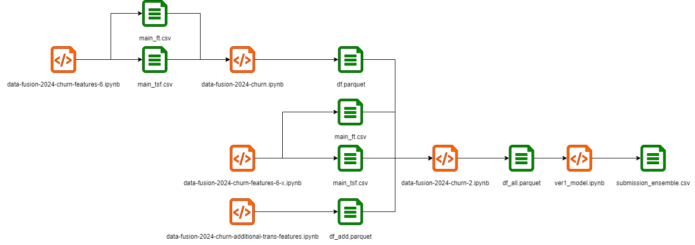

#### Решение 5 места соревнования [Data Fusion Contest 2024 - Задача 2 «Отток»](https://ods.ai/competitions/data-fusion2024-churn)

[Лидерборд](https://ods.ai/competitions/data-fusion2024-churn/leaderboard/private)

Результат получен совместно с KotVasily (он же тот самый Марк:]).

Сорян за грязный код, но это же соревнование)) Большая часть скриптов запускалась на кагле, поэтому пути к файлам от кагл датасетов. В целом всё должно работать.

##### Суть решения

Концептуально решение простое, было нагенерено несколько тысяч фичей, отобрали лучшие и сделали ансамбль бустингов.

Попробуем разобраться во всех ноутбуках.

1. Основной ноут data-fusion-2024-churn.ipynb, дающий на выходе файл df.parquet. В этом ноуте собрана большая часть фичегенерации из публичных бейзлайнов, реализованы мои идеии по генерации и какие-то предложения от chatgpt. Также этот ноут использует выходные файлы от ноута data-fusion-2024-churn-features-6.ipynb (main_ft.csv, main_tsf.csv), внутри которого идет чисто генерация фич на последовательностях транзакций пакетами featuretools и tsfresh.
2. Дополнительные ноуты генерации фич теми же автопакетами:
data-fusion-2024-churn-features-6-2.ipynb -> main_ft.csv, main_tsf.csv
data-fusion-2024-churn-features-6-3.ipynb -> main_ft.csv, main_tsf.csv
data-fusion-2024-churn-features-6-4.ipynb -> main_ft.csv, main_tsf.csv
data-fusion-2024-churn-features-6-5.ipynb -> main_ft.csv, main_tsf.csv
data-fusion-2024-churn-features-6-6.ipynb -> main_ft.csv, main_tsf.csv
data-fusion-2024-churn-features-6-7.ipynb -> main_ft.csv
data-fusion-2024-churn-features-6-8.ipynb -> main_ft.csv, main_tsf.csv
В них код 1 в 1, как и в оригинальном data-fusion-2024-churn-features-6.ipynb, но последовательности транзакций изменены, где-то вместо транзакций произведена замена на mcc коды, где-то вместо транзакций поданы дельты по времени между транзакциями и т.п.
3. data-fusion-2024-churn-additional-trans-features.ipynb -- Это смысловая копия основного ноута data-fusion-2024-churn.ipynb, но во всех блоках генерации фич на последовательностях транзакций оригинальные цепочки транзакций тоже подменены разными модификациями по аналогии с пунктом выше. На выходе ноут дает файл df_add.parquet.
4. data-fusion-2024-churn-2.ipynb -- Ноут, объединяющий все отобранные признаки из ноутбуков выше, и, добавляющий фичегенерацию Марка. На выходе дает файл df_all.parquet.
5. ver1_model.ipynb -- Финальный скрипт, берущий все-все отобранные топ признаки, и, делающий предикт ансамблем. Дает на выходе submission_ensemble.csv.

Ну и схемка, чтобы было еще понятнее:

##### Разные мысли

* До объединения у меня была где-то 12 позиция, а у Марка 16. После мерджа мы попали на 4 место паблика, и пару дней даже были на 1 месте. Не стесняйтесь объединяться)
* Спасибо всем за открытые бейзлайны, они разогнали конкурс.
* Пробовали авто мл пакеты, но ни один из них не дал высокого скора (~0,76).
* Пробовали нейронки, но они тоже не дали высокого скора (~0,74 чисто на последовательностях, ~0,77 полносвязные)
* Пробовали отдельные модели для разных report_date -- не зашло.
* За счет модификаций исходных последовательностей транзакций можно было получать кратное число новых признаков.
* Предикт time, как вспомогательной фичи, не зашел.
* Эмбеддинги от нейронок не зашли.
* Очень хотим мерч)
